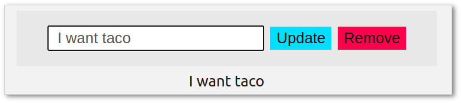

# yew-setup-2021

A simple [yew](https://github.com/yewstack/yew) app template for 2021.



[View Demo](http://tokyo800.jp/mina/yew-setup-2021/)

[1. About](#1-about)  
[2. Dev + Build](#2-dev--build)  
[3. What I Did](#3-what-i-did)  
&nbsp; &nbsp; [3-1. Webpack 5 Specific](#3-1-webpack-5-specific)  
&nbsp; &nbsp; [3-2. Serving from Subdirectory](#3-2-serving-from-subdirectory)  
&nbsp; &nbsp; [3-3. Walk-through](#3-3-walk-through)  
&nbsp; &nbsp; &nbsp; &nbsp; [[(a) JS-WASM Bootstrap](#a-js-wasm-bootstrap)  
&nbsp; &nbsp; &nbsp; &nbsp; [(b) `#app`](#b-app)  
&nbsp; &nbsp; &nbsp; &nbsp; [(c) `App`](#c-app)  
&nbsp; &nbsp; &nbsp; &nbsp; [(d) `Container`](#d-container)  
&nbsp; &nbsp; &nbsp; &nbsp; [(e) `Control`](#e-control)  
&nbsp; &nbsp; &nbsp; &nbsp; [(f) `Msg`](#f-msg)  
&nbsp; &nbsp; &nbsp; &nbsp; [(g) `State` + `Entry`](#g-state--entry)  
[4. Installed Packages: JS](#4-installed-packages--js)  
[5. Installed Packages: Rust](#5-installed-packages--rust)  
[6. LICENSE](#6-license)

&nbsp;

## 1. About

My simple [yew](https://github.com/yewstack/yew) app template for 2021.  
Codes are basically taken from
[yew's official TODO app example](https://github.com/yewstack/yew-wasm-pack-template),
only, I made it simpler.

Some differences:

- No `entries` but a single `entry`
- No filtering list items
- Breaking into several components
- Separate files
- Calling parent callback from a child
- Bound to `#app`
- Webpack 5 latest configurations

&nbsp;

## 2. Dev + Build

### Dev

```
yarn start
```

### Prod

```
yarn build
```

&nbsp;

## 3. What I Did

Nothing very special... Just 2 things.

### 3-1. Webpack 5 Specific

Not much to mention, but you need to be careful with Webpack 5.  
You get the following error when compile:

```
ERROR in ./pkg/index_bg.wasm 1:0
Module parse failed: Unexpected character '' (1:0)
The module seem to be a WebAssembly module, but module is not flagged as WebAssembly module for webpack.
BREAKING CHANGE: Since webpack 5 WebAssembly is not enabled by default and flagged as experimental feature.
You need to enable one of the WebAssembly experiments via 'experiments.asyncWebAssembly: true' (based on async modules) or 'experiments.syncWebAssembly: true' (like webpack 4, deprecated).
For files that transpile to WebAssembly, make sure to set the module type in the 'module.rules' section of the config (e. g. 'type: "webassembly/async"').
(Source code omitted for this binary file)
 @ ./pkg/index.js 1:0-40
 @ ./bootstrap.js 3:0-15
```

So, if you look into the parts in concern:

`pkg/index_bg.js`

```js
import * as wasm from './index_bg.wasm';
...
...
export function run_app() {
  wasm.run_app(); // `wasm` here is undefined
}
```

you will notice `wasm` is not properly imported.  
There, you need to set the following Webpack option:

`webpack.base.js`

```js
  experiments: {
    syncWebAssembly: true,
  }
```

### 3-2. Serving from Subdirectory

Also, I added `output.publicPath` because I am serving
the content from subdirectory in `production`.

`webpack.prod.js`

```js
  output: {
    publicPath: '/mina/yew-setup-2021/',
  },
```

### 3-3. Walk-through

Although the app is based on
[yew's official TODO app example](https://github.com/yewstack/yew-wasm-pack-template),
it maybe worth explaining how the app works.

#### (a) JS-WASM Bootstrap

Let's look at [webpack.base.js](webpack.base.js).

`webpack.base.js`

```js
module.exports = {
  entry: './bootstrap.js',
  output: {
    filename: 'memo.js',
    path: path.resolve(__dirname, 'dist'),
    webassemblyModuleFilename: 'memo.wasm',
  },
  ...
  ...
  plugins: [
    ...
    ...
    new CopyWebpackPlugin({
      patterns: [
        {
          from: './static',
          to: path.resolve(__dirname, 'dist'),
        },
      ],
    }),
    ...
    ...
```

It all begins with [bootstrap.js](bootstrap.js) (upon Webpack builds).  
For any Yew apps, as Webpack builds, it runs
[wasm-pack](https://github.com/rustwasm/wasm-pack).  
(and [wasm-bindgen](https://github.com/rustwasm/wasm-bindgen) behind it)

Files are emitted to `dist`:

```
./dist
 ├── assets
 │  └── favicon.ico
 ├── index.html
 ├── memo.js
 ├── memo.wasm
 └── pkg_index_js.memo.js
```

`index.html` is just a copy of `static/index.html`.  
I copy the entire `static` directory to `dist`, so is `index.html` within.

`index.html`:

```html
<!DOCTYPE html>
<html>
  ... ... ...
  <script src="./memo.js"></script>
</html>
```

At runtime, `memo.js` asynchronously loads `memo.wasm`.

Yew takes care of auto-generation for all the JS-WASM bootstrap files.
Yet, if you want to generate JS-WASM bootstrap files manually,
[I have written instructions in the past](https://github.com/minagawah/perlin-experiment#3-what-i-did) which may help.


#### (b) `#app`

Let's look at Rust codes in `src`:

```
./src
 ├── app.rs
 ├── components
 │   ├── container.rs
 │   ├── control.rs
 │   └── mod.rs
 ├── constants.rs
 ├── entry.rs
 ├── lib.rs
 ├── message.rs
 └── state.rs
```

As it is defined in [Cargo.toml](Cargo.toml),
it begins with [src/lib.rs](src/lib.rs).

`src/lib.rs`:

```rust
#![recursion_limit = "512"]

mod app;
pub mod components;
pub mod constants;
pub mod entry;
pub mod message;
pub mod state;

use wasm_bindgen::prelude::*;
use yew::App;

#[wasm_bindgen]
pub fn run_app() -> Result<(), JsValue> {
    wasm_logger::init(wasm_logger::Config::default());

    if let Some(elem) = yew::utils::document().query_selector("#app").unwrap() {
        App::<app::App>::new().mount(elem);
        Ok(())
    } else {
        Err(JsValue::from("No element to bind"))
    }
}
```

Just like any other `wasm-bindgen` apps, it will run `run_app()`.  
Notice it either returns `()` or `JsValue` that are wrapped in `Result`.

To bind the app, we are using `query_selector()` to look for `#app`,
and `App` is bound to the element.

Also, see how modules are defined:

```rust
pub mod components;
pub mod constants;
pub mod entry;
pub mod message;
pub mod state;
```

#### (c) `App`

As you can see, there are not much in `App` ([src/app.rs](src/app.rs))
because majority of the codes are defined in separate modules.

Let's see what we have for `view()`.

`src/app.rs`:

```rust
    fn view(&self) -> Html {
        // Event handlers passed down to Control component.
        let on_edit_handler = self.link.callback(Msg::Edit);
        let on_remove_handler = self.link.callback(|_| Msg::Remove);

        html! {
            <Container>
                <Control
                    entry=self.state.entry.clone()
                    on_edit=on_edit_handler.clone()
                    on_remove=on_remove_handler.clone()
                />

                <div id="description">
                    { &self.state.entry.description }
                </div>

                <div id="footer">
                    <a href="https://github.com/minagawah/yew-setup-2021">
                        { "View Source" }
                    </a>
                </div>
            </Container>
        }
    }
```

You can tell the followings:

- Everything is wrappedn in `<Container>`
- Passing event handlers to `<Control>` as props
- The event handlers emit `Msg::Xxx`
- Data will be stored to `self.state.entry`

Now, let's look at `create()`.

```rust
    fn create(_: Self::Properties, link: ComponentLink<Self>) -> Self {
        let storage = StorageService::new(Area::Local).unwrap();

        let entry = {
            if let Json(Ok(restored_entry)) = storage.restore(KEY) {
                restored_entry
            } else {
                Entry::new("")
            }
        };

        let state = State { entry };

        App {
            link,
            storage,
            state,
        }
    }
```

- First checks (in localstorage) if we have previously stored data


- The app first checks the localstorage for the previously saved `entry`
- `State` is set to `self.state`
- `Entry` is set to `self.state.entry`

At this point, we wonder what these structs are:

- `Msg`
- `Container`
- `Control`
- `State`
- `Entry`

and you can see how they are imported:

```rust
use crate::components::container::Container;
use crate::components::control::Control;
use crate::constants::KEY;
use crate::entry::Entry;
use crate::message::Msg;
use crate::state::State;
```

#### (d) `Container`

Before looking into `Container`, let us recall how Rust modules work.  
Within `src/components`, we have [mod.rs](src/components/mod.rs).

`src/components/mod.rs`:

```rust
pub mod container;
pub mod control;
```

Whenever other files want `Container`, this is how it is done:

```rust
use crate::components::container::Container;
```

Now, let's see what we have in `Container`
([src/components/container.rs](src/components/container.rs)).

`src/components/container.rs`:

```rust
    fn view(&self) -> Html {
        html! {
            <div id="container">
                { self.props.children.clone() }
            </div>
        }
    }
```

There is not much, but it just wraps the given component with _<div>_.

One thing worth mentioning, it compares (within `change()`) current props
with previous props for any changes.  
Otherwise, it will not pick up changes in children.

```rust
    fn change(&mut self, props: Self::Properties) -> ShouldRender {
        if self.props != props {
            // Allow children to be re-rendered when `props.children` changes.
            self.props = props;
            true
        } else {
            false
        }
    }
```

#### (e) `Control`

Let's have a look at `Control`
([src/components/control.rs](src/components/control.rs)).  
I call it _"Control"_ because it has input forms and some buttons.

Many things are happening.  
It takes `entry` as a prop.  
It listens for button clicks.

Let's look at `view()`:

`src/components/control.rs`:

```rust
    fn view(&self) -> Html {
        let inputting = self.link.callback(|e: InputData| Msg::Update(e.value));
        let pressing = self.link.callback(|e: KeyboardEvent| {
            if e.key() == "Enter" {
                Msg::EmitEdit
            } else {
                Msg::Nope
            }
        });
        let editing = self.link.callback(|_| Msg::EmitEdit);
        let removing = self.link.callback(|_| Msg::EmitRemove);

        let mut entry_style = "entry".to_string();

        // A bit darker color when editing.
        if self.props.entry.editing {
            entry_style.push_str(" entry-in-progress");
        }

        html! {
            <div id="control">
                <input
                    ref=self.memo_input_ref.clone()
                    value=&self.value
                    class=entry_style
                    oninput=inputting
                    onkeypress=pressing
                />

                <div id="buttons">
                    <button class="btn btn-update" onclick=editing>
                        { "Update" }
                    </button>

                    <button class="btn btn-remove" onclick=removing>
                        { "Remove" }
                    </button>
                </div>
            </div>
        }
    }
```

So, we have `self.memo_input_ref.clone()` attached to an input form.
This is a _"ref"_ (which is `NodeRef` copy) for the element
so that I can _focus_ on the input form.


#### (f) `Msg`

Continued with `Control`, we have 2 buttons,
and we also have corresponding event handlers.

`src/components/control.rs`:

```rust
        let editing = self.link.callback(|_| Msg::EmitEdit);
        let removing = self.link.callback(|_| Msg::EmitRemove);
```

The handlers both emit `Msg::Xxx`.

Let's see the definition in `Msg` ([src/message.rs](src/message.rs)):

`src/message.rs`:

```rust
pub enum Msg {
    Update(String),
    EmitEdit,
    Edit(String),
    EmitRemove,
    Remove,
    Nope,
}
```

When "Update" button is clicked, `editing()` handler runs, and it emits `Msg::EmitEdit`.
Now, let's see how `Msg::EmitEdit` behaves:

`src/components/control.rs`:

```rust
    fn update(&mut self, msg: Self::Message) -> ShouldRender {
        match msg {
            Msg::Update(val) => {
                self.value = val;
            }
            Msg::EmitEdit => {
                // Calling the parent's callback.
                self.props.on_edit.emit(self.value.clone());
                self.focus();
            }
            Msg::EmitRemove => {
                // Calling the parent's callback.
                self.props.on_remove.emit(());
                self.value = "".into();
                self.focus();
            }
            _ => {}
        }
        true
    }
```

So, it calls `self.props.on_edit.emit()`.  
As you can see, it calls `on_edit_handler()`  
(which is a prop passed down from `App`)


`src/app.rs`:

```rust
    fn update(&mut self, msg: Self::Message) -> ShouldRender {
        match msg {
            Msg::Update(_) => {
                self.state.entry.editing = true;
            }
            Msg::Edit(val) => {
                info!("val: {}", val);
                self.state.entry.description = val;
                self.state.entry.editing = false;
            }
            Msg::Remove => {
                self.state.reset();
                self.state.entry.editing = false;
            }
            _ => {}
        }
        self.storage.store(KEY, Json(&self.state.entry));
        true
    }

    fn view(&self) -> Html {
        // Event handlers passed down to Control component.
        let on_edit_handler = self.link.callback(Msg::Edit);
        let on_remove_handler = self.link.callback(|_| Msg::Remove);

        html! {
            <Container>
                <Control
                    entry=self.state.entry.clone()
                    on_edit=on_edit_handler.clone()
                    on_remove=on_remove_handler.clone()
                />

                <div id="description">
                    { &self.state.entry.description }
                </div>

                <div id="footer">
                    <a href="https://github.com/minagawah/yew-setup-2021">
                        { "View Source" }
                    </a>
                </div>
            </Container>
        }
    }
```

See what it is doing:

```rust
let on_edit_handler = self.link.callback(Msg::Edit);
```

Clicking "Update" first emits `Msg::EmitEdit`.
In `Msg::EmitEdit`, it calls `self.props.on_edit.emit()`.
And, it is actually emitting `Msg::Edit(String)`.

`Msg::EmitRemove` and `Msg::Remove` work the same.

Just for a clarification, `Msg::Update` is in `Control`.
As long as users type something into the input form,
it constantly calls `inputting()`, and emits `Msg::Update`.

`src/components/control.rs`:

```rust
        let inputting = self.link.callback(|e: InputData| Msg::Update(e.value));
        ...
        ...
                <input
                    ref=self.memo_input_ref.clone()
                    value=&self.value
                    class=entry_style
                    oninput=inputting
                    onkeypress=pressing
                />
```

#### (g) `State` + `Entry`

OK. Let's look at `Msg::Edit(String)`.  
What does it do?

`src/app.rs`:

```rust
    fn update(&mut self, msg: Self::Message) -> ShouldRender {
        match msg {
            Msg::Update(_) => {
                self.state.entry.editing = true;
            }
            Msg::Edit(val) => {
                info!("val: {}", val);
                self.state.entry.description = val;
                self.state.entry.editing = false;
            }
            Msg::Remove => {
                self.state.reset();
                self.state.entry.editing = false;
            }
            _ => {}
        }
        self.storage.store(KEY, Json(&self.state.entry));
        true
    }
```

Essentially, the given value is eventually set to `self.state.entry.description`:

```rust
                self.state.entry.description = val;
                self.state.entry.editing = false;
```

So, we are setting the value to `Entry` (in `State`).

Let's firt look at `Entry` ([src/entry.rs](src/entry.rs))

`src/entry.rs`:

```rust
#[derive(Serialize, Deserialize, Clone)]
pub struct Entry {
    pub description: String,
    pub editing: bool,
}

impl Entry {
    pub fn new(description: &str) -> Self {
        Entry {
            description: description.into(),
            editing: false,
        }
    }
}
```

and `State` ([src/state.rs](src/state.rs))

`src/state.rs`:

```rust
use crate::entry::Entry;

#[derive(Serialize, Deserialize)]
pub struct State {
    pub entry: Entry,
}

impl State {
    pub fn reset(&mut self) {
        self.entry = Entry::new("");
    }
}
```

Do you need an explanation?  
It looks pretty straight forward to me...

&nbsp;


## 4. Installed Packages: JS

### All NPM Packages

```
yarn add --dev webpack webpack-cli webpack-dev-server css-loader style-loader postcss-loader autoprefixer webpack-merge clean-webpack-plugin copy-webpack-plugin license-webpack-plugin wasm-pack @wasm-tool/wasm-pack-plugin prettier pretty-quick
```

yarn remove http-server

### Webpack

- webpack
- webpack-cli
- webpack-dev-server
- css-loader
- style-loader
- postcss-loader
- autoprefixer
- webpack-merge
- clean-webpack-plugin
- copy-webpack-plugin
- license-webpack-plugin

### WASM Related

- wasm-pack
- @wasm-tool/wasm-pack-plugin

### Others

- prettier
- pretty-quick

&nbsp;

## 5. Installed Packages: Rust

Almost the same as
[yew's official TODO app](https://github.com/yewstack/yew-wasm-pack-template).  
See [Cargo.toml](Cargo.toml)

&nbsp;

## 6. License

Dual-licensed under either of the followings.  
Choose at your option.

- The UNLICENSE ([LICENSE.UNLICENSE](LICENSE.UNLICENSE))
- MIT license ([LICENSE.MIT](LICENSE.MIT))
